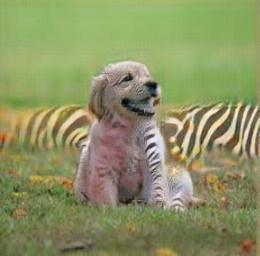

# Exercises

## 1. Feed the image of the golder retriever into the horse-to-zebra model.

### 1.a. What do you need to do to the image to prepare it?

The image needs to be transformed in the same way as was used to preprocess images for training the horse-to-zebra model. This includes two steps:

1. Resizing the smaller edge of the image to 256 pixels while maintaining the aspect ratio.
2. Transformating the image to a tensor.

Additionally, since the model uses batches of images, we need to unsqueeze an extra dimension into the image tensor.

```py
img = Image.open("data/puppy.jpg")

preprocess = transforms.Compose([
  transforms.Resize(256),
  transforms.ToTensor(),
])

img_t = preprocess(img)
batch_t = torch.unsqueeze(img_t, 0)
```

Now the image is transformed into a form that the model can understand.

```py
batch_out = netG(batch_t)

out_t = (batch_out.data.squeeze() + 1.0) / 2.0
out_img = transforms.ToPILImage()(out_t)
out_img.save("data/puppy-zebra.jpg")
out_img
```

### 1.b. What does the output look like?

The output is bizarre. The model painted some white strips on the golden retriever as well as on the flowers in the background. The output looks like as if there is a zebra lying down on the grass behind the golden retriever.



## 2. Search GitHub for projects that provide a `hubconf.py` file.

### 2.a. How many repositories are returned?

I used the `path` qualifier to search for all GitHub repositories that provide a `hubconf.py` file. At the time for writing, there were around **1.7k** such repositories.

### 2.b. Find an interesting-looking project with a `hubconf.py` file. Can you understand the purpose of the project from the documentation?

I found the repository: `ultralytics/yolov5` that provides a `hubconf.py` file. According to the documentation, it is a very fast and very accurate object detection model. Moreover, the network head can be changed to perform instance segmentation.

### 2.c. Bookmark the project, and come back after you have finished this book. Can you understand the implementation?

Hopefully, I will remember to do that.
