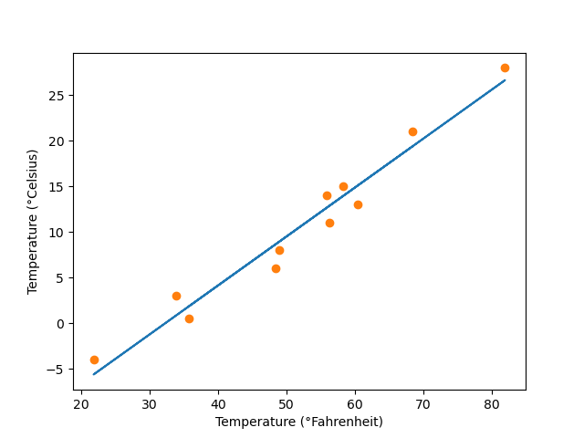
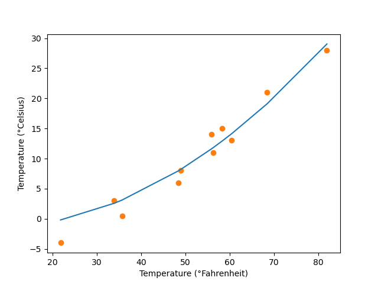

# Exercises

## 1. Redefine the model to be `w2 * t_u ** 2 + w1 * t_u + b`.

## 1.a. What parts of the training loop, and so on, need to changed to accommodate this redefinition?

Only the model definition and the parameter tensor need to be changed in order to accommodate this redefinition. The parameter tensor now needs to account for three variables: $[w_1, w_2, b]$.

```py
def model(x, w1, w2, b):
    return w2 * x ** 2 + w1 * x + b

# ...

params = torch.tensor([1.0, 1.0, 0.0], requires_grad=True)
```

## 1.b. What parts are agnostic to swapping out the model?

The loss function, training loop, and the optimizer remain the same. This is because the loss function only cares about the final predicted value (and not how it was generated) so it has nothing to do with the model internals.

The training loop simply calls the model to produce a predicted output, uses this predicted output to calculate loss, perform a backward pass, and update the model parameters. This process is the same exact process that happens everytime is completely independent to how the model produces the output.

Finally, the optimizer just handles the updating of parameters and does not care about the model internals either.

```py
def loss_fn(y, y_pred):
    squared_diffs = (y - y_pred) ** 2
    return squared_diffs.mean()


def train(n_epochs, x, y, optimizer, params):
    for epoch in range(1, n_epochs + 1):
        y_pred = model(x, *params)
        loss = loss_fn(y, y_pred)

        optimizer.zero_grad()
        loss.backward()
        optimizer.step()

    return params

optimizer = Adam([params], lr=1e-2)
```

## 1.c. Is the resulting loss higher or lower after training?

The resulting loss of this model is $3.8327$ after $5000$ epochs, whereas, the linear model has a loss of $2.9276$ after the same number of epochs. So this model has a higher loss than the linear model.

## 1.d. Is the actual result better or worse?

The actual result is worse, since the model is trying to fit a quadratic curve into a dataset that is linear in nature. As a result, this new model (although achieves a lower training loss) will not generalize well to unseen data points.

| Linear Model (_old_)                    | Quadratic Model (_new_)                    |
| --------------------------------------- | ------------------------------------------ |
|  |  |
