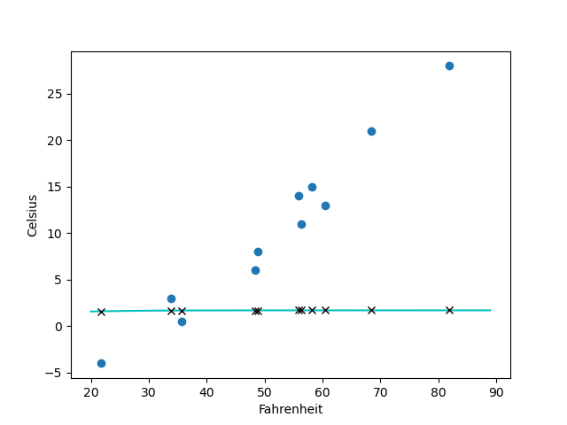
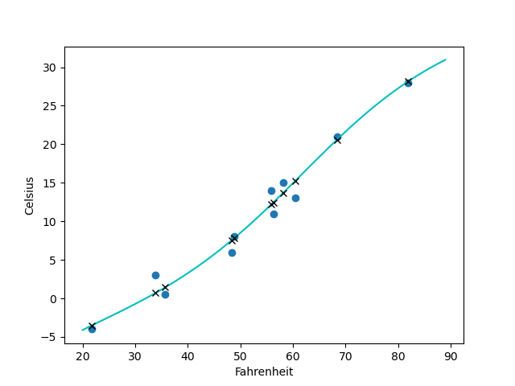
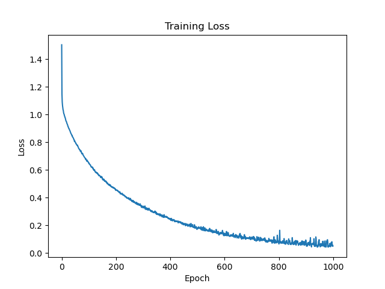
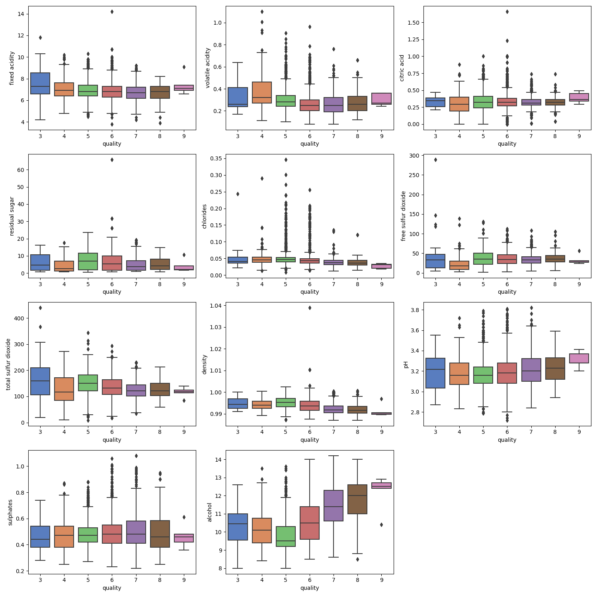
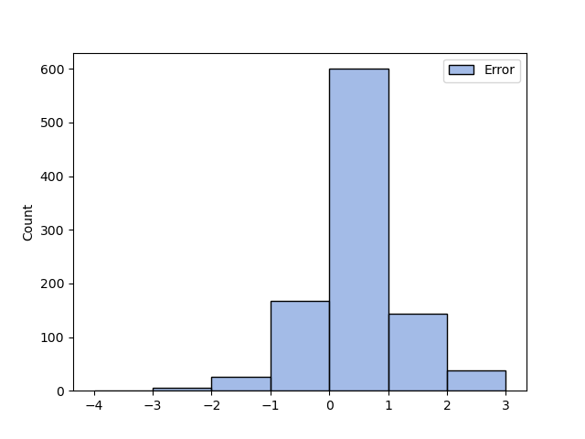

# Exercises

## 1. Experiment with the number of hidden neurons in our simple neural network model, as well as the learning rate.

To experiment with the simple neural network, we can create a function that takes the number of hidden neurons and learning rate as parameters. We can then call this function with various values for these parameters to see the resulting model, its training loss, and validation loss.

```py
def experiment(hidden_neurons, learning_rate):
    print(f"Hidden neurons: {hidden_neurons}, Learning rate: {learning_rate}")
    model = nn.Sequential(
        nn.Linear(1, hidden_neurons),
        nn.Tanh(),
        nn.Linear(hidden_neurons, 1),
    )

    optimizer = optim.SGD(model.parameters(), lr=learning_rate)

    train(
        n_epochs=5000,
        model=model,
        optimizer=optimizer,
        loss_fn=nn.MSELoss(),
        X_train=X_train_normalized,
        X_val=X_val_normalized,
        y_train=y_train,
        y_val=y_val,
    )

    visualize(X, y, model)

for i in range(1, 21):
    for j in [1e-3, 1e-4]:
        experiment(hidden_neurons=i, learning_rate=j)
```

### 1.a. What changes result in a more linear output from the model?

Since the data is generated from a linear distribution, it is hard to differentiate which model has a tendency towards linear model and which model is overfitting. In either case, the result will look like a linear model.

However, a simpler model lacks the ability to estimate complex nonlinear behavior, so a model with very few hidden neurons and a very low learning rate will likely have a more linear output.

```py
experiment(hidden_neurons=1, learning_rate=1e-4)
```



### 1.b. Can you get the model to obviously overfit the data?

A high number of hidden neurons with a suitable learning rate (so that the training is stable and the model converges) will cause the model to overfit the data. This is evident by the gap in the training loss and validation loss.

```py
experiment(hidden_neurons=20, learning_rate=1e-3)
```

**Output**

```txt
Hidden neurons: 20, Learning rate: 0.001
Epoch: 1, Training loss: 186.3171, Validation loss: 180.2154
Epoch: 1000, Training loss: 3.8941, Validation loss: 3.8063
Epoch: 2000, Training loss: 2.0927, Validation loss: 3.8224
Epoch: 3000, Training loss: 1.7978, Validation loss: 3.7291
Epoch: 4000, Training loss: 1.5289, Validation loss: 3.8752
Epoch: 5000, Training loss: 1.4141, Validation loss: 4.0108
```



## 2. The third hardest problem in physics is finding a proper wine to celebrate discoveries. Load the wine dataset from chapter 4, and create a new model with the appropriate number of input parameters.

The wine dataset is loaded through the `pandas` library as a dataframe. We create the features and target numpy arrays, and split them into train and test dataset. Then, we convert them to tensors and wrap them in a data loader.

```py
wine_df = pd.read_csv("data/wine.csv", delimiter=";")

X = wine_df.drop("quality", axis=1).values
y = wine_df["quality"].values

X_train, X_test, y_train, y_test = train_test_split(X, y, test_size=0.2)

scaler = StandardScaler()

X_train = scaler.fit_transform(X_train)
X_test = scaler.fit_transform(X_test)

X_train = torch.tensor(X_train, dtype=torch.float32)
X_test = torch.tensor(X_test, dtype=torch.float32)
y_train = torch.tensor(y_train, dtype=torch.long)
y_test = torch.tensor(y_test, dtype=torch.long)

train_dataset = TensorDataset(X_train, y_train)
test_dataset = TensorDataset(X_test, y_test)
train_loader = DataLoader(train_dataset, batch_size=32, shuffle=True)
test_loader = DataLoader(test_dataset, batch_size=32, shuffle=True)
```

For the wine dataset, the task is a multiclass classification. As such, we create a neural network with three layers. The first layer takes the 11 features as input and forwards it to 64 hidden neurons in the second layer. The third layer transforms these into 11 output features (to account for the 11 score classes: 0 to 10).

Since, this is a multiclass classification, we use cross entropy loss as the loss function. The optimizer used is an Adam optimizer with a moderate learning rate of $1 \times 10^{-3}$.

```py
in_features = 11
hidden_features = 64
out_features = 11

model = nn.Sequential(
    nn.Linear(in_features, hidden_features),
    nn.ReLU(),
    nn.Linear(hidden_features, hidden_features),
    nn.ReLU(),
    nn.Linear(hidden_features, out_features),
)

criterion = nn.CrossEntropyLoss()
optimizer = optim.Adam(model.parameters(), lr=1e-3)
```

In the training loop, we iterate over the inputs and targets from the data loader (as batches of 32) in each epoch. Since the loss calculated during each iteration is for the given batch only, we accumulate these losses into `running_loss`, and divide by the total number of samples in the data loader at the end of each epoch, to get the average epoch loss.

```py
def train(n_epochs, model, criterion, optimizer, train_loader):
    losses = []
    start_time = time.time()

    for epoch in tqdm(range(n_epochs)):
        running_loss = 0.0

        for inputs, targets in train_loader:
            optimizer.zero_grad()
            outputs = model(inputs)
            loss = criterion(outputs, targets)
            loss.backward()
            optimizer.step()
            running_loss += loss.item() * inputs.shape[0]

        epoch_loss = running_loss / len(train_loader.dataset)
        losses.append(epoch_loss)

    training_time = time.time() - start_time
    return losses, training_time

losses, training_time = train(
    n_epochs=1000,
    model=model,
    criterion=criterion,
    optimizer=optimizer,
    train_loader=train_loader,
)
```

We then evalute this model on the test set in order to measure its accuracy (it predicted the exact correct score) and average error (how much deviation on average is between the prediction and ground truth). This model achieved an accuracy of $61.22\%$ with an average error of just $0.47$ which is not bad considering how simple the neural network is.

```py
def evaluate(model, test_loader):
    n = 0
    correct = 0
    running_loss = 0

    model.eval()
    loss_fn = nn.L1Loss()

    with torch.no_grad():
        for inputs, targets in test_loader:
            outputs = model(inputs)
            _, predicted = torch.max(outputs, 1)

            n += targets.shape[0]
            correct += (predicted == targets).sum().item()

            loss = loss_fn(predicted.to(torch.float32), targets.to(torch.float32))
            running_loss += loss.item() * targets.shape[0]

    accuracy = (correct / n) * 100
    average_error = running_loss / n

    return accuracy, average_error

accuracy, average_error = evaluate(model, test_loader)
print(f"Accuracy: {accuracy:.2f}%, Average error: {average_error:.2f}")
```

**Output**

```txt
Accuracy: 61.22%, Average error: 0.47
```

### 2.a. How long does it take to train compared to the temperature data we have been using?

Training this model on the wine dataset takes considerably longer than the training the previous model on the temperature dataset. Training this model for 1000 epochs took $260.27$ sec whereas the training on the temperature dataset was much faster.

### 2.b. Can you explain what factors contribute to the training times?

Several factors contribute to the training time:

- **Number of samples**: More samples require more time for each epoch.
- **Number of features**: Higher dimensional data requires more computation per sample.
- **Number of layers**: A model with more layers requires more computation for each forward pass.
- **Number of neurons**: More neurons per layer requires more computation for each forward pass.
- **Type of layers**: Convolutional layers and recurrent layers require more computation than simple fully connected layers.

Besides these, there are hardware limitations that contribute to the training time. For example, GPUs are generally much faster (usually x50 times faster than CPU) for deep learning tasks due to their parallel processing capabilities.

### 2.c. Can you get the loss to decrease while training on this dataset?

Yes, we used the Adam optimizer (which is very stable) with a learning rate of $1 \times 10^{-3}$. After training the model, we plot the loss at each epoch and it can be clearly seen that the loss decreased considerably within the first few 100 epochs before coming to a steady state at around 800 epochs.



### 2.d. How would you go about graphing this dataset?

We can plot each dataset feature against the target variable, `quality`, using a boxplot (such as from `seaborn`). This allows us to visualize how each feature is distributed relative to the quality.

```py
fig, axs = plt.subplots(4, 3, figsize=(15, 15))
sns.boxplot(data=wine_df, x="quality", y="fixed acidity", palette="muted", ax=axs[0, 0])
sns.boxplot(data=wine_df, x="quality", y="volatile acidity", palette="muted", ax=axs[0, 1])
sns.boxplot(data=wine_df, x="quality", y="citric acid", palette="muted", ax=axs[0, 2])
sns.boxplot(data=wine_df, x="quality", y="residual sugar", palette="muted", ax=axs[1, 0])
sns.boxplot(data=wine_df, x="quality", y="chlorides", palette="muted", ax=axs[1, 1])
sns.boxplot(data=wine_df, x="quality", y="free sulfur dioxide", palette="muted", ax=axs[1, 2])
sns.boxplot(data=wine_df, x="quality", y="total sulfur dioxide", palette="muted", ax=axs[2, 0])
sns.boxplot(data=wine_df, x="quality", y="density", palette="muted", ax=axs[2, 1])
sns.boxplot(data=wine_df, x="quality", y="pH", palette="muted", ax=axs[2, 2])
sns.boxplot(data=wine_df, x="quality", y="sulphates", palette="muted", ax=axs[3, 0])
sns.boxplot(data=wine_df, x="quality", y="alcohol", palette="muted", ax=axs[3, 1])

axs[3, 2].axis("off")
fig.tight_layout()
plt.show()
```



In order to visualize how well the model is performing, we can compare the predictions to the ground truth. But because the target variable is discrete and there are $980$ samples in the test set, a plot of both predictions and ground truth would be very crowded.

Therefore, we chose to measure the errors between the predictions and the ground truth, and plot the errors instead as a histogram. The histogram shows that a lot of errors are $0$ (which means the prediction is perfect), although a few are off by 1 or 2 points, but none is more than 3 points.


