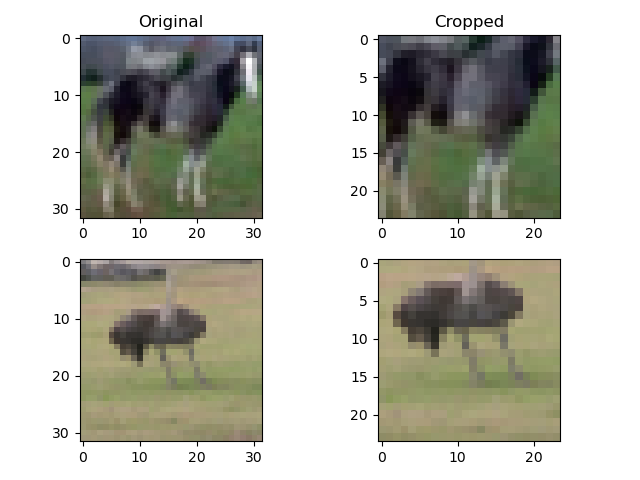
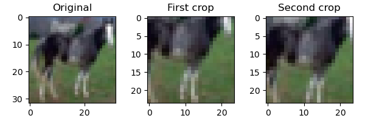

# Exercises

## 1. Use `torchvision` to implement random cropping of the data.

To implement random cropping, we can use `transforms.RandomCrop()` from the `torchvision` module. It takes a `size` parameter that represents the desired output size of the cropped image.

```py
transform = transforms.Compose([
    transforms.ToTensor(),
])

crop = transforms.RandomCrop(size=(24, 24))
```

### 1.a. How are the resulting images different from the uncropped originals?

We load the CIFAR-10 dataset and test the random crop transform on two random images (a horse at index $37$ and an ostrich at index $42$).

```py
transform = transforms.Compose([
    transforms.ToTensor(),
])

cifar10 = datasets.CIFAR10("data/", train=True, download=False, transform=transform)
cifar10_val = datasets.CIFAR10("data/", train=False, download=False, transform=transform)

crop = transforms.RandomCrop(size=(24, 24))

img37, _ = cifar10[37]
img42, _ = cifar10[42]

img37_t = crop(img37)
img42_t = crop(img42)

fig, axs = plt.subplots(2, 2)

axs[0, 0].imshow(img37.permute(1, 2, 0))
axs[0, 1].imshow(img37_t.permute(1, 2, 0))
axs[1, 0].imshow(img42.permute(1, 2, 0))
axs[1, 1].imshow(img42_t.permute(1, 2, 0))

axs[0, 0].set_title("Original")
axs[0, 1].set_title("Cropped")

plt.tight_layout()
plt.show()
```

The resulting images are a randomly selected subset of the original images of size $(24, 24)$.



### 1.b. What happens when you request the same image a second time?

We use the horse image at index $37$ of the CIFAR-10 dataset, and call the crop transform two times on the same image.

```py
img, _ = cifar10[37]

img_t1 = crop(img)
img_t2 = crop(img)

fig, axs = plt.subplots(1, 3)

axs[0].imshow(img.permute(1, 2, 0))
axs[1].imshow(img_t1.permute(1, 2, 0))
axs[2].imshow(img_t2.permute(1, 2, 0))

axs[0].set_title("Original")
axs[1].set_title("First crop")
axs[2].set_title("Second crop")

plt.tight_layout()
plt.savefig("data/subsequent-crops.png")
plt.show()
```

The two crops are different regions of size $(24, 24)$ cropped from the same original image.



### 1.c. What is the result of training using randomly cropped images?

We train a model with flattened versions of these randomly cropped images as inputs and evaluate the accuracy on both the training set and validation set.

```py
transform = transforms.Compose([
    transforms.ToTensor(),
    transforms.Normalize(mean=(0.4914, 0.4822, 0.4465), std=(0.2470, 0.2435, 0.2616)),
    transforms.RandomCrop(size=(24, 24)),
])

cifar10 = datasets.CIFAR10("data/", train=True, download=False, transform=transform)
cifar10_val = datasets.CIFAR10("data/", train=False, download=False, transform=transform)

label_map = {0: 0, 2: 1}
class_names = ["airplane", "bird"]

cifar2 = [(img, label_map[label]) for img, label in cifar10 if label in [0, 2]]
cifar2_val = [(img, label_map[label]) for img, label in cifar10_val if label in [0, 2]]

train_loader = DataLoader(cifar2, batch_size=64, shuffle=True)
val_loader = DataLoader(cifar2_val, batch_size=64, shuffle=False)

in_features = 3 * 24 * 24
out_features = 2

model = nn.Sequential(
    nn.Linear(in_features, 1024),
    nn.Tanh(),
    nn.Linear(1024, 512),
    nn.Tanh(),
    nn.Linear(512, 128),
    nn.Tanh(),
    nn.Linear(128, out_features),
)

loss_fn = nn.CrossEntropyLoss()

learning_rate = 1e-2
optimizer = optim.SGD(model.parameters(), lr=learning_rate)

def train(n_epochs, dataloader, model, loss_fn, optimizer):
    epochs = list(range(n_epochs))
    losses = []

    for epoch in tqdm(epochs):
        for imgs, labels in dataloader:
            batch_size = imgs.shape[0]
            outputs = model(imgs.view(batch_size, -1))
            loss = loss_fn(outputs, labels)

            optimizer.zero_grad()
            loss.backward()
            optimizer.step()

        losses.append(loss.item())

    plt.plot(epochs, losses)
    plt.xlabel("Epoch")
    plt.ylabel("Loss")
    plt.title("Training Loss")
    plt.show()

def evaluate(dataloader, model):
    correct = 0
    total = 0

    with torch.no_grad():
        for imgs, labels in dataloader:
            batch_size = imgs.shape[0]
            outputs = model(imgs.view(batch_size, -1))
            _, predicted = torch.max(outputs, dim=1)
            total += labels.shape[0]
            correct += int((predicted == labels).sum())

    accuracy = 100 * correct / total
    return accuracy

train(
    n_epochs=100,
    dataloader=train_loader,
    model=model,
    loss_fn=loss_fn,
    optimizer=optimizer
)

train_accuracy = evaluate(train_loader, model)
val_accuracy = evaluate(val_loader, model)

print(f"Training accuracy: {train_accuracy:.2f}%, Validation accuracy: {val_accuracy:.2f}%")
```

This model achieved an accuracy of $100.00\%$ on the training set and $77.15\%$ on the validation set, which is worse than the previous model (that used original images instead of the cropped images) with a training accuracy of $100.00\%$ and a validation accuracy of $81.10\%$.

One possible explanation is that, it is harder to learn complete structure of the object (bird or airplane) from cropped images (which are not able to show the entirety of the object in all images).

## 2. Switch loss function (perhaps MSE).

To switch to MSE loss, we change the label format from just an index to form $(1, 0)$ for airplanes and $(0, 1)$ for birds. This allows the output of the model with a shape of $(N, 2)$ to be compared using MSE loss with the labels naturally.

```py
label_map = {
    0: torch.tensor([1, 0], dtype=torch.float32),
    2: torch.tensor([0, 1], dtype=torch.float32)
}

# rest of the code stays the same

loss_fn = nn.MSELoss()

# ...
```

### 2.a. Does the training behavior change?

To evaluate the model performance, we modify the `evaluate()` function so that it compares the index of the maximum value in the model output with the index of the maximum value in the label.

```py
def evaluate(dataloader, model):
    correct = 0
    total = 0

    with torch.no_grad():
        for imgs, labels in dataloader:
            batch_size = imgs.shape[0]
            outputs = model(imgs.view(batch_size, -1))
            _, pred = torch.max(outputs, dim=1)
            _, gt = torch.max(labels, dim=1)
            total += labels.shape[0]
            correct += int((pred == gt).sum())

    accuracy = 100 * correct / total
    return accuracy


train_accuracy = evaluate(train_loader, model)
val_accuracy = evaluate(val_loader, model)

print(f"Training accuracy: {train_accuracy:.2f}%, Validation accuracy: {val_accuracy:.2f}%")
```

This gives a training accuracy of $98.83\%$ and a validation accuracy of $79.55\%$, which is worse than the previous model (that used cross-entropy loss) with a training accuracy of $100.00\%$ and a validation accuracy of $81.10\%$. This makes sense since MSE loss is not well suited to classification problems with categorical data.

## 3. Is it possible to reduce the capacity of the network enough that it stops overfitting?

We decreased the number of layers in the neural network to just $2$ and decreased the number of hidden neurons to just $2$. This results in a similar performance on both the training set and validation set, so yes, the model is not overfitting as much as it was when the neural network was deeper and complex.

```py
in_features = 3 * 32 * 32
out_features = 2

model = nn.Sequential(
    nn.Linear(in_features, 2),
    nn.ReLU(),
    nn.Linear(2, out_features),
)
```

### 3.a. How does the model perform on the validation set when doing so?

This model gives a training accuracy of $86.88\%$ and a validation accuracy of $79.55\%$. Although the model is not overfitting nearly as much as the more complex model (which had a training accuracy of $100.00\%$), the performance on the validation set is slightly worse, since the more complex model had a validation accuracy of $81.10\%$.
