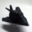

# Exercises

## 1. Change our model to use a $5 \times 5$ kernel with `kernel_size=5` passed to the `nn.Conv2d` consructor.

Since we want to keep the output of convolution to remain the same size as the input, we would need to increase padding to $2$ in order to use a kernel of shape $5 \times 5$.

```py
"""
Model Architecture:
    conv -> relu -> maxpool -> conv -> relu -> maxpool -> flatten -> linear -> relu -> linear

Input shapes:
    (x)   -> N, 3, 32, 32  -> (conv1) -> N, 16, 32, 32 -> (relu) -> N, 16, 32, 32 -> (maxpool) -> N, 16, 16, 16 -> (out)
    (out) -> N, 16, 16, 16 -> (conv2) -> N, 8, 16, 16  -> (relu) -> N, 8, 16, 16  -> (maxpool) -> N, 8, 8, 8    -> (out)
    (out) -> N, 8, 8, 8    -> (view)  -> N, 8 * 8 * 8  -> (out)
    (out) -> N, 8 * 8 * 8  -> (fc1)   -> N, 32         -> (relu) -> N, 32 -> (out)
    (out) -> N, 32         -> (fc2)   -> N, 2          -> (out)
"""

class Net(nn.Module):
    def __init__(self):
        super().__init__()
        self.conv1 = nn.Conv2d(3, 16, kernel_size=5, padding=2)
        self.conv2 = nn.Conv2d(16, 8, kernel_size=5, padding=2)
        self.fc1 = nn.Linear(8 * 8 * 8, 32)
        self.fc2 = nn.Linear(32, 2)

    def forward(self, x):
        out = F.max_pool2d(torch.relu(self.conv1(x)), 2)
        out = F.max_pool2d(torch.relu(self.conv2(out)), 2)
        out = out.view(-1, 8 * 8 * 8)
        out = torch.relu(self.fc1(out))
        out = self.fc2(out)
        return out
```

### 1.a. What impact does this change have on the number of parameters in the model?

To check the number of parameters in this model, we can use the following code:

```py
numel_list = [p.numel() for p in model.parameters()]
print(f"Total parameters: {sum(numel_list)}")
print(f"Parameters in each submodule: {numel_list}")
```

**Output**

```txt
Total parameters: 20906
Parameters in each submodule: [1200, 16, 3200, 8, 16384, 32, 64, 2]
```

These are slightly more than the previous model, for which this was the output:

```txt
Total parameters: 18090
Parameters in each submodule: [432, 16, 1152, 8, 16384, 32, 64, 2]
```

This is because the convolution layers now use an increased kernel size, which results in $3 \times 16 \times 5 \times 5 = 1200$ parameters in the first convolution layer and $16 \times 8 \times 5 \times 5 = 3200$ parameters in the second convolution layer. This is an increase by $2.778$. All other parameters remain the same, such as the number of bias for the convolution layers ($16$ and $8$ respectively).

### 1.b. Does the change improve or degrade overfitting?

To measure the accuracy, we use the following code:

```py
def evaluate(model, train_loader, val_loader, device):
    data_loaders = [("Training", train_loader), ("Validation", val_loader)]

    for name, data_loader in data_loaders:
        correct = 0
        total = 0
        with torch.no_grad():
            for inputs, targets in data_loader:
                inputs = inputs.to(device)
                targets = targets.to(device)

                outputs = model(inputs)
                _, predictions = torch.max(outputs, dim=1)
                correct += int((predictions == targets).sum())
                total += targets.shape[0]

        accuracy = (correct / total) * 100
        print(f"{name} accuracy: {accuracy:.2f}%")
```

**Output**

```txt
Training accuracy: 97.57%
Validation accuracy: 89.15%
```

Using the same evaluation function on the previous model gives the following results.

**Output**

```txt
Training accuracy: 92.99%
Validation accuracy: 90.05%
```

It can be observed that the validation accuracy is almost the same (the model is not generalizing any better), but the training accuracy increased a lot. This clearly shows that the model is overfitting a lot more than the previous model.

There are two possible explanations:

- This model has more parameters than the previous model, so it is more prone to overfitting.
- The receptive field of the convolution layers is increased, so they are able to capture a larger area of the input images, which are now allowing the model to learn more complex features, thereby, making it more to prone to overfitting.

### 1.c. Read [`torch.nn.Conv2d` documentation](https://pytorch.org/docs/stable/generated/torch.nn.Conv2d.html#torch.nn.Conv2d).

The [`torch.nn.Conv2d` documentation](https://pytorch.org/docs/stable/generated/torch.nn.Conv2d.html#torch.nn.Conv2d) states that `torch.nn.Conv2d` applies a 2D convolution (more precisely, 2D cross-correlation) over each input channel to produce a specified number of output channels. The convolution operation can additionally add a bias to the output of correlation in case `bias=True` is set.

The convolution operation is controlled by these parameters:

- `kernel_size` which controls the shape of the kernel,
- `stride` which controls the step size taken while performing the cross-correlation,
- `padding` which controls the amount of padding applied to the input,
- `dilation` which controls the spacing between kernel points.

The values for these parameters can either be an integer and tuple (of two integers). In case of integer, the same value is used for the height and width dimension, whereas, in the case of tuple, the first is used for the height dimension and the second is used for the width dimension.

### 1.d. Can you describe what `kernel_size=(1, 3)` will do?

If the kernel has a $1 \times 3$ shape, the convolution will result in a non-square output feature map. This is because, the kernel can only encompass a single row, so the height of the input and output feature maps will be the same, but the width will be reduced. Let us consider a simple $4 \times 4$ image:

```math
\begin{bmatrix}
i_{00} & i_{01} & i_{02} & i_{03} \\
i_{10} & i_{11} & i_{12} & i_{13} \\
i_{20} & i_{21} & i_{22} & i_{23} \\
i_{30} & i_{31} & i_{32} & i_{33} \\
\end{bmatrix}
\star
\begin{bmatrix}
w_{0} & w_{1} & w_{2} \\
\end{bmatrix}
=
\begin{bmatrix}
x_{00} & x_{01} \\
x_{10} & x_{11} \\
x_{20} & x_{21} \\
x_{30} & x_{31} \\
\end{bmatrix}
```

We can test this with a sample image using the following code:

```py
img, _ = cifar2[0]

sq_conv = nn.Conv2d(3, 1, kernel_size=(3, 3))
rect_conv = nn.Conv2d(3, 1, kernel_size=(1, 3))
sq_out = sq_conv(img)
rect_out = rect_conv(img)

img = img.permute(1, 2, 0)
sq_out = sq_out.permute(1, 2, 0)
sq_out = sq_out.detach().numpy()
rect_out = rect_out.permute(1, 2, 0)
rect_out = rect_out.detach().numpy()


fig, (ax1, ax2, ax3) = plt.subplots(1, 3, figsize=(6, 4))
ax1.imshow(p_image)
ax2.imshow(sq_out)
ax3.imshow(rect_out)
plt.show()
```


### 1.e. How does the model behave with such a kernel?

We can modify the model architecture to use this kernel size for its convolution layers, and measure the accuracy of the model on the training and validation sets.

```py
class WierdNet(nn.Module):
    def __init__(self):
        super().__init__()
        self.conv1 = nn.Conv2d(3, 16, kernel_size=(1, 3), padding="same")
        self.conv2 = nn.Conv2d(16, 8, kernel_size=(1, 3), padding="same")
        self.fc1 = nn.Linear(8 * 8 * 8, 32)
        self.fc2 = nn.Linear(32, 2)

    def forward(self, x):
        out = F.max_pool2d(torch.relu(self.conv1(x)), 2)
        out = F.max_pool2d(torch.relu(self.conv2(out)), 2)
        out = out.view(-1, 8 * 8 * 8)
        out = torch.relu(self.fc1(out))
        out = self.fc2(out)
        return out

# rest of the code remains the same
```

**Output**

```txt
Training accuracy: 92.61%
Validation accuracy: 88.20%
```

It can be observed that the model performed very similar to how the previous model (with square kernel sizes) performed, although slightly worse.

A possible explanation is that the way convolutional networks work with convolution layers followed by pooling followed by flattening followed by fully connected layers, the model is still able to capture patterns at both local scale and large scale. However, at the local scale, the model is limited to horizontal elements, so it is unable to make sense of vertical features.

## 2. Can you find an image that contains neither a bird nor an airplane, but that the model claims has one or the other with more than $95\%$ confidence?

We can use the softmax function from the functional API to produce confidence scores. We can then iterate over the CIFAR-10 dataset and use these confidence scores to find those images for which the model produces a confidence score of more than $95 \%$ for either airplane or bird, but is in reality, neither of them.

```py
model.eval()

for idx, (img, label) in enumerate(cifar10):
    if label not in [0, 2]:
        with torch.no_grad():
            out = model(img)
            confidences = F.softmax(out, dim=1)
            confidences = confidences.detach().numpy()[0]
            if (confidences[0] > 0.95) or (confidences[1] > 0.95):
                print(idx)
                break
```

**Output**

```txt
Index: 3
```

We can now use this index position to find the image for which the model over-generalized, and inspect the model outputs.

```py
model.eval()
img, label = cifar10[idx]

with torch.no_grad():
    out = model(img)
    confidences = F.softmax(out, dim=1)
    confidences = confidences.detach().numpy()[0]
    print(f"Ground truth: {cifar10.classes[label]}")
    print(f"Confidence for airplane: {confidences[0] * 100:.2f}%")
    print(f"Confidence for bird: {confidences[1] * 100:.2f}%")

plt.imshow(img.permute(1, 2, 0))
plt.axis("off")
plt.show()
```

**Output**

```txt
Ground truth: deer
Confidence for airplane: 4.33%
Confidence for bird: 95.67%
```


So the model thinks that this image of a deer is actually a bird with a very high confidence.

### 2.a Can you manually edit a neutral image to make it more airplane-like?

We can again use the softmax function to find an image for which the model predicts that it is an airplane with an approximately $50 \%$ confidence. And then use that index position to inspect this image and the model output more closely.

```py
model.eval()

for idx, (img, label) in enumerate(cifar10):
    if label not in [0, 2]:
        with torch.no_grad():
            out = model(img)
            confidences = F.softmax(out, dim=1)
            confidences = confidences.detach().numpy()[0]
            if (0.45 <= confidences[0] <= 0.55):
                print(idx)
                break

# rest of the code remains the same
```

**Output**

```txt
Index: 20

Ground truth: deer
Confidence for airplane: 52.33%
Confidence for bird: 47.67%
```


This image can look like an airplane if we made the head and the back legs of the deer longer and thicker. For this we can an image editting tool like GIMP. After modification, the image looks like this:


Now, we can run the same code to get the confidence scores from our model.

```py
with torch.no_grad():
    out = model(img)
    confidences = F.softmax(out, dim=1)
    confidences = confidences.detach().numpy()[0]
    print(f"Confidence for airplane: {confidences[0] * 100:.2f}%")
    print(f"Confidence for bird: {confidences[1] * 100:.2f}%")
```

**Output**

```txt
Confidence for airplane: 86.92%
Confidence for bird: 13.08%
```

And we can see that the model now predicts with a very high confidence that the image is an airplane.

### 2.b. Can you manually edit an airplane image to trick the model into reporting a bird?

We can use the following code to find the first airplane image in the CIFAR-10 dataset.

```py
for idx, (img, label) in enumerate(cifar10):
    if label == 0:
        print(f"Index: {idx}")
        break
```

**Output**

```txt
Index: 29
```

The corresponding image is shown below along with model's output. The model rightfully predicts for this image that it is an airplane.

```txt
Ground truth: airplane
Confidence for airplane: 94.10%
Confidence for bird: 5.90%
```



To make this airplane look like a bird, we can make the tail of the airplane wider to look like a bird's head, and add two legs near the head of the airplane. Also, because our model takes RGB images as input, we need to add bright colors to the image, since most of the images with birds in the CIFAR-10 dataset are in wild.

The final result looks like the following image:


The model now predicts with a very high confidence that the image is a bird.

```txt
Confidence for airplane: 2.60%
Confidence for bird: 97.40%
```

### 2.c. Do these tasks get easier with a network with less capacity or more capacity?

Confusing model by manually editing input images is much easier on models with less capacity, since they are not able to learn too much detail about a specific class. So we can modify the image in certain ways to trick the model into thinking that it is seeing an image of the other class.
